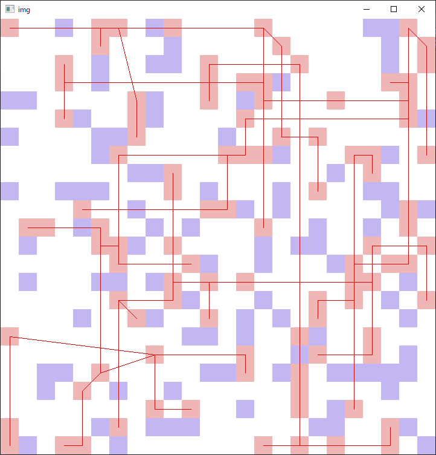
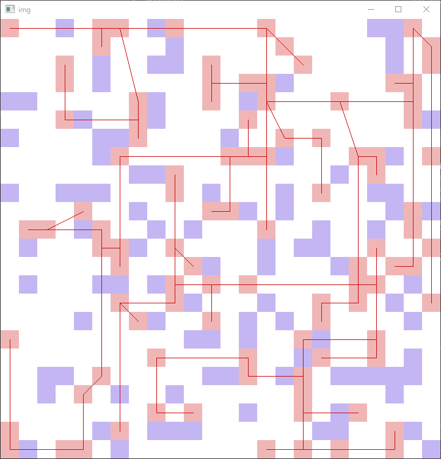
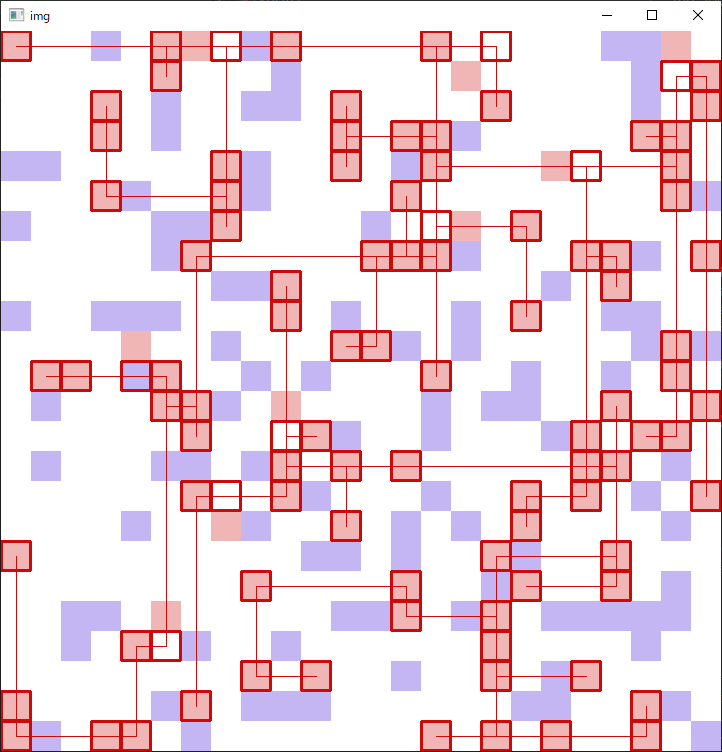

#### 一日目

移動: 上下左右の最寄りが同じ色なら加点？

2回以上移動したら全域木にはできない

理論値は `K*100*99/2 = 4950*K` 

```
K=2: 9900
K=3: 14850
K=4: 19800
K=5: 24750
```

上限は 866250 点くらい？

テスターのスコア計算に高速化の余地はあるか？ → めっちゃある

出力では移動->接続の順だが、解の構成時には気にしなくてよい (接続したノードは動かせなくなる / 辺は横切れなくなる)
* 同時に最適化することも考慮に入れておく

K=5 として、サイズ 20 の連結成分を 5 個作るよりサイズ 100 の連結成分を 1 つ作ったほうが自明に良い (950 < 4950)
* 満遍なく繋ぐより、色を限定したほうがよい

`M (<K)`  色揃えることを目標とすれば、移動に `(K-M)*100` 回くらいは割くことができる

サイズ上位の連結成分を連結するのに必要な操作回数くらいは接続操作のために取っておくのがよさそう　バランス調整むずそう

`64^4=2^24`なので、各操作は整数に pack 可能

#### 二日目

ウ　何もわからない

#### 三日目

dancing link 的なデータ構造を使う？

ポインタを使って書いた後でコピーしたらこわれることに気付く

id で管理するよう修正

移動部分のビームサーチを書いた

同じクラスタのケーブルであっても交差が許されないことを失念していた　むずすぎる

<b>提出 1 回目:</b> 移動はビームサーチ、接続は貪欲で <b>174864</b>

<b>提出 2 回目:</b> ビームサーチの評価関数を軽量化（4 方向で同色のものの個数ベース）したら <b>201837</b>

#### 四日目

ビームを飛ばさず丁寧に一色揃える方向で考えている

単純計算で `4950*50=247500` 点になるので

ただ、キツキツに詰まった盤面をどうにかするのは難しいかも

巨大クラスタを生成する方針
* 同色の全点対をなんらかのコストで結んで完全グラフを作る
  * min(dx, dy)
  * 矩形領域に含まれる他ノードの個数
  * とか
* kruskal で最小全域木を作成
* コストが低くなるように各点を元の位置から少しスライドさせる焼きなまし or ビームサーチ
  * 移動回数は限られているので、どこへでも移動可とするのはまずい

上述の最小全域木を構成すると以下のようになる (seed=8, cost=16)



ここで困るのが、交差した辺が存在すること

解消するにはいくつかの方法が考えられる

* 辺の繋ぎ変えによって交差を減らす
  * ある辺を取り除く
  * 連結成分 U, V に分かれたとして、u∈U, v∈V の全通りに対してコスト計算して最小のものを採用
* 交差のない木を生成したあと、コストを小さくしていく

#### 五日目

交差のない木をつくる



雑な焼きなましで少し移動させて斜めの辺を無くす



あとは

* クラスタに含まれるノードを目的地まで移動させる
* クラスタ外のノードが辺上に置かれないようにする

この 2 つをなるべく短い手数で達成すればよさそう